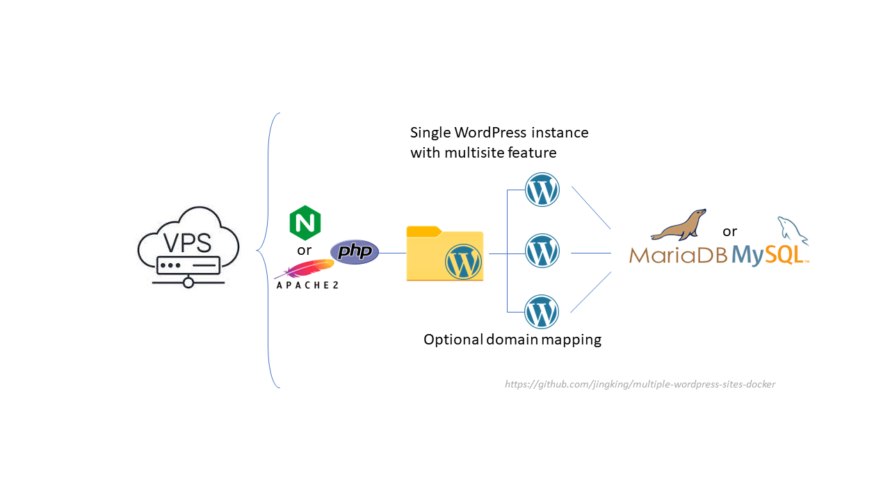
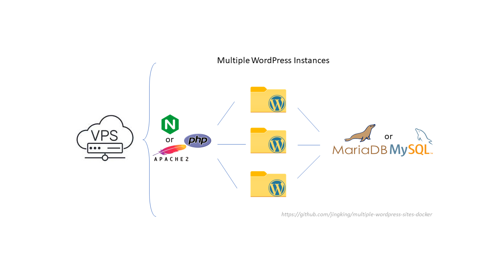
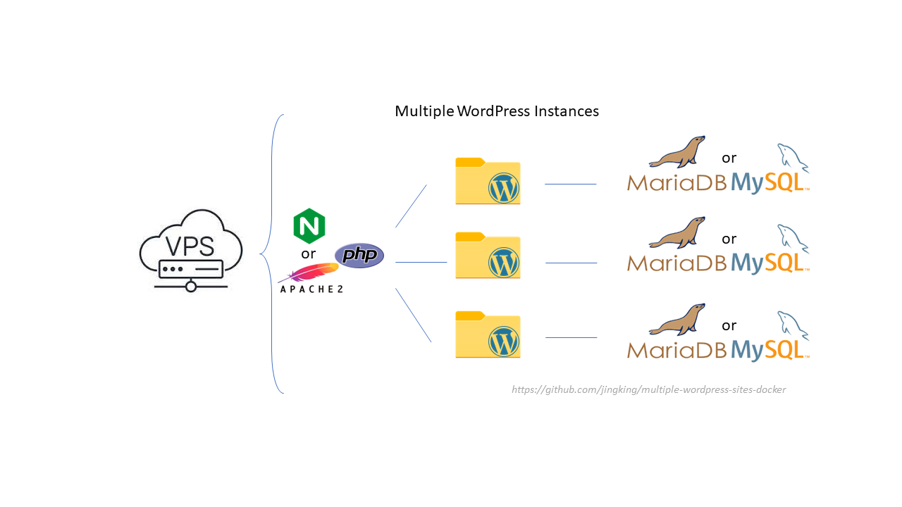
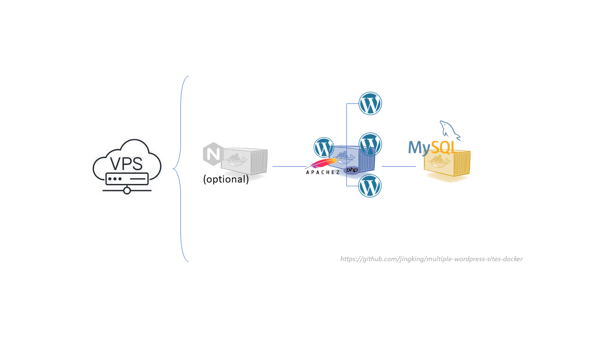
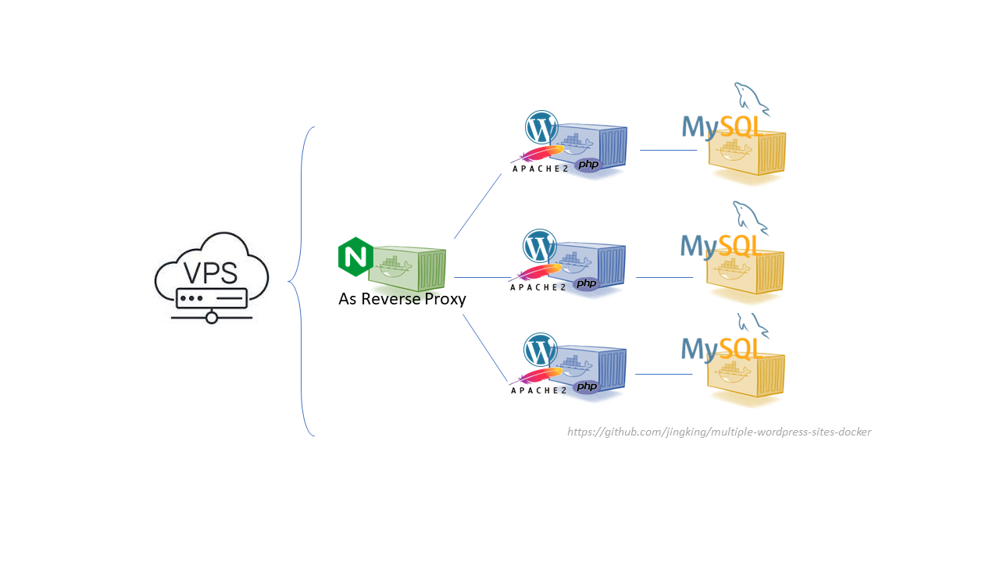
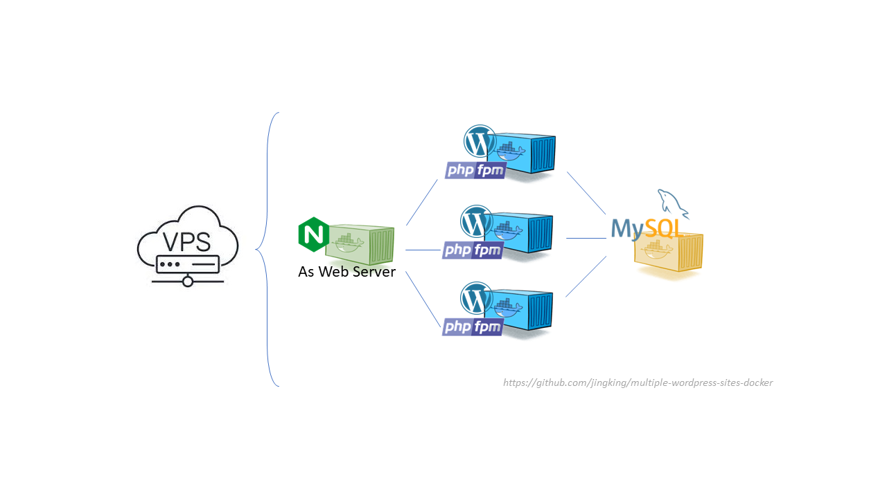

# Deployment Options for Multiple WordPress Sites on a Single Server
 

1. Install single WordPress instance and turn on the multisite feature
  
  - Easiest way to add multiple sites to existing single WordPress installation 
  - Built-in feature after WordPress >= v3 - just need to manually edit the wp-config.php file to turn it on 
  - Subsites or subfolder options provided by default; Ideal for big organizations with many department sites (e.g. department1.myorgonization.org, department2.myorgonization.org) 
  - If need independent domains (e.g. domain1.com, domain2.com) - WordPress >= v4.5 introduced domain mapping as a native feature.
https://wpmudev.com/blog/domain-mapping-wordpress-multisite/ 
 
2. Install Multiple WordPress Instances 
		2.1. Multiple WordPress Instances sharing a single database 

		2.2 Multiple WordPress Instances with each instance using its own database instance 

https://www.digitalocean.com/community/tutorials/how-to-set-up-multiple-wordpress-sites-on-a-single-ubuntu-vps
  
3. Single WordPress docker with multisites 
similar to option 1. 

https://bobcares.com/blog/docker-wordpress-multisite/
  
4. Multiple WordPress Docker Containers 
		4.1. Nginx + multiple wordpress + multiple databse instances 

https://linuxhandbook.com/deploye-multiple-wordpress/ 
		4.2. Nginx + multiple wordpress (php-fpm) + single database 

https://github.com/jingking/multiple-wordpress-sites-docker#readme	
